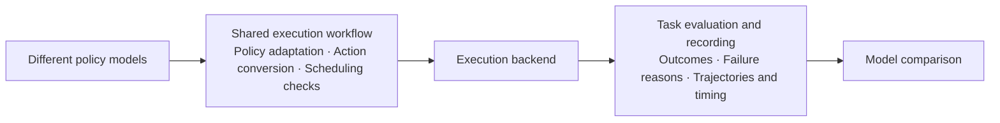

# Cross-Backend Robot Policy Deployment and Evaluation

Reusable interfaces for **running robot policies, evaluating tasks, and comparing results across execution backends**. Current integrations cover SO101 and MuJoCo, with a separate ALOHA ACT/DOT comparison.

## Policy demo


[Watch the full-resolution video](docs/media/aloha-comparison.mp4). These are fresh learned-policy rollouts recorded on 2026-09-28, not fixed trajectories. Seed 1000: DOT completes the transfer and ACT does not. Seed 1001: ACT completes it and DOT does not. Both receive the same initial seed per pair; success means episode maximum reward >= 4. Shorter clips hold their last frame for synchronized playback.

The two examples illustrate behavior, not a success-rate estimate. [Demo scores and provenance](evidence/demo-results.json) are separate from the earlier 30-seed study.

## Architecture



Observations feed back from the backend to the policy. Task configuration defines initial conditions and completion rules. The SO101/MuJoCo implementations share observation, action, receipt, and result contracts. A unified evaluation entry point now selects policies, launches the native runners, and records common results. ALOHA retains its two model-specific evaluators underneath this entry point.

## Results and current scope

| Evaluation | Recorded result | What it establishes |
| --- | --- | --- |
| ALOHA ACT / DOT, 30 paired seeds | **11/30 / 26/30** successful transfers | Comparison of two concrete deployment systems on seeds 1000–1029; evaluator versions and preprocessing differ |
| SO101 / SmolVLA | **One confirmed placement**, 494 audited action/dispatch pairs | A successful development run through the shared execution boundary; no success-rate estimate |
| SO101 / ACT | [**0/3 task successes**](evidence/so101-act-full-cycle-results.json) in three completed 18-second hardware trials; all three returned to their recorded start poses | 533 / 532 / 534 audited policy packets; shared execution works, but reliable tape placement is not established |

The SmolVLA placement did not complete a return-to-start cycle. The three SO101/ACT hardware trials did; the tape remained outside the mat after each trial. They are formal full-cycle attempts, not a paired-initial-state model comparison. Existing SO101 and MuJoCo runs are not a same-policy, paired-initial-state performance study. Formal SO101 model comparison and simulation-to-hardware validation remain open.

Fresh unified-entry comparisons on 2026-09-28 completed **30 ALOHA pairs (ACT 14/30, DOT 27/30)** and **10 nominal MuJoCo pairs (ACT 0/10, SmolVLA 0/10; all task timeouts with completed execution)**. [Study results and evidence](docs/STUDY_RESULTS.md) distinguish these from the historical runs. Measured simulation/hardware pairing is in calibration; task failure remains valid evidence.

[Historical result data](evidence/results.json) retains per-seed scores and hardware audit summaries. Its old raw videos and packet logs were removed during earlier cleanup, so those hardware findings cannot be independently replayed from this repository. The new demo above has separately retained media. SO101, ALOHA, ACT, DOT, and SmolVLA are validated examples with different levels of support, not arbitrary interchangeable combinations.

## Run and develop

With the local ACT/DOT checkpoints and compatible LeRobot/ALOHA environments prepared:

```bash
python3 scripts/evaluate.py --config configs/eval-aloha.json \
  --python /path/to/lerobot/.venv/bin/python --output artifacts/aloha-new
```

The example configuration runs two episodes per model; edit `episodes` and `first_seed` for a larger evaluation. [Unified evaluation guide](docs/EVALUATION.md) covers ALOHA, MuJoCo and SO101 configurations, dry runs, and the shared result format. Task failure is recorded separately from execution failure. The command runs simulation only and uses offline model loading. Checkpoints are not distributed here. [Setup, test commands, and script guide](docs/ARCHITECTURE.md#running-and-testing) describe the required environments and supported entry points.

Fixed-trajectory demos, obsolete training workflows, one-off diagnostics, and duplicate release builders have been removed. MuJoCo backend tests retain scene, state-restoration, and task-observer coverage. New physical motion requires an explicitly approved on-site plan; historical profiles are not settings for an arbitrary robot.

## Project layout

- `src/cross_backend/`: policy adapters, shared execution, backend implementations, task evaluation, and recording.
- `scripts/`: retained model runners, calibration/capture tools, and result analysis.
- `tests/`, `configs/`, `assets/`: tests, current reference profiles, and SO101 simulation scenes/meshes.
- `evidence/`, `docs/media/`: compact results and the README policy demo.
- `artifacts/`, `models/`: ignored local run outputs and inference resources.

See [architecture and script responsibilities](docs/ARCHITECTURE.md). Original code uses [MIT](LICENSE); upstream meshes and DOT compatibility code retain their licenses in [third-party notices](THIRD_PARTY_NOTICES.md).
