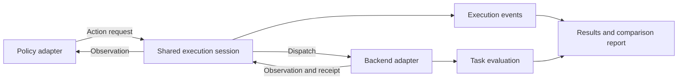

# PolicyBridge — Robot Policy Execution & Evaluation

A shared interface for **deploying robot policies, executing actions across backends, and evaluating task outcomes**. Configure a run once, launch it through one entry point, and get a readable report with consistent result fields.

ACT, DOT, SmolVLA, SO101 and the simulation environments are example integrations. The project's reusable components are the policy/backend contracts, execution lifecycle and evaluation workflow.

## How it works



The execution session validates observations and actions, dispatches commands, checks receipts, and handles stopping and event recording. Model preprocessing, chunk scheduling, device setup and backend timing stay in their adapters. Task criteria determine success separately: a completed evaluation can contain a failed task, while an unknown outcome remains unknown.

Simulation and hardware are evaluated independently. Model comparisons use the same backend, task and declared conditions; matching a simulated scene to a physical setup is outside the core scope.

## Try the interface without a model or robot

```bash
python3 -m pip install -r requirements-core.txt
python3 examples/adapter_template/run.py
```

The [adapter template](examples/adapter_template/README.md) runs a two-joint memory backend through the shared lifecycle. Copy it to start a new integration; it requires no weights or devices.

## Run an evaluation

Prepare the local checkpoints and compatible model/simulation environments described in the [setup guide](docs/REPRODUCIBILITY.md), then run:

```bash
python3 scripts/evaluate.py --config configs/eval-aloha.json \
  --python /path/to/lerobot/.venv/bin/python \
  --output artifacts/aloha-new
```

Before launching, the command checks local resources and model feature compatibility. Use `--check-environment` without `--output` to run those diagnostics independently.

This example runs ACT and DOT for two simulation episodes each. Edit the configuration to select models, checkpoint paths, episode count and device. Add `--dry-run` to inspect the resolved plan. The output directory must be new; weights are loaded locally and are not bundled or downloaded automatically.

```text
artifacts/aloha-new/
├── report.md       # Model totals, outcomes, execution reasons and evidence links
├── results.json    # Common result fields and provenance hashes
├── plan.json       # Resolved configuration and native commands
├── preflight.json  # Resource and environment diagnostics
├── logs/           # Runner output and execution traces
└── raw/            # Native scores, records and generated media
```

See the [evaluation guide](docs/EVALUATION.md) for configuration fields, hardware validation and result semantics.

## Example integrations

| Backend | Task | Example models | Configuration |
| --- | --- | --- | --- |
| ALOHA simulation | Transfer cube between grippers | ACT, DOT | [eval-aloha.json](configs/eval-aloha.json) |
| MuJoCo simulation | Move object onto a mat | ACT, SmolVLA | [eval-mujoco.json](configs/eval-mujoco.json) |
| SO101 hardware | Move object onto a mat | ACT, SmolVLA | [eval-so101.json](configs/eval-so101.json) |

All three integrations route policy actions through the shared execution session. Native model processors and outer episode scheduling remain adapter-specific. SO101 supports offline configuration validation and one explicitly approved physical run using its site-specific audited profile.

## Example results

The ALOHA comparison used the unified evaluation entry point:

| Backend / task | Model | Successful tasks | Recorded execution |
| --- | --- | ---: | --- |
| ALOHA / transfer cube | ACT | 14 / 30 | All episodes completed |
| ALOHA / transfer cube | DOT | 27 / 30 | All episodes completed |

ALOHA used the same requested seeds (2000–2029) and a common reward-based success rule. These results describe the tested deployments; evaluator versions and preprocessing differ. See the [full study report](docs/STUDY_RESULTS.md) for conditions, uncertainty, other simulation experiments and evidence references.

Hardware examples include one confirmed SmolVLA placement and an ACT placement with verified return to start. The current [ACT trial summary](evidence/so101-act-full-cycle-results.json) records one success across seven development trials and six verified returns. Trial configurations changed, including the motion-gate settings for the successful run, so these counts are not a controlled success-rate benchmark or an ACT/SmolVLA ranking. The SmolVLA placement did not include a complete return-to-start cycle.

[Watch representative ALOHA runs](docs/EXAMPLES.md). The two video cases illustrate behavior; the table above summarizes the separate 30-episode comparison.

## Extend the project

- **Add a model:** adapt its inputs and outputs to provide an `ActionRequest` from a backend observation. Keep preprocessing, unit conversion and action queues in the policy adapter.
- **Add a backend:** implement `observe`, `dispatch` and `stop`, and declare joint names, units, cameras, clock and feedback capabilities.
- **Add a task:** define its initial conditions and completion criteria, then connect its outcomes to the evaluation records.

Run `python3 scripts/test_core.py` for the portable interface regression suite; the GitHub workflow runs it on pushes and pull requests.

The [extension guide](docs/EXTENDING.md) includes the common execution interface and integration details. The existing models demonstrate these interfaces; adding another model normally requires an adapter.

## Documentation and repository layout

| Resource | Contents |
| --- | --- |
| [Evaluation](docs/EVALUATION.md) | Commands, configurations and report fields |
| [Extension interfaces](docs/EXTENDING.md) | Policy and backend contracts |
| [Architecture and tests](docs/ARCHITECTURE.md) | Implementation responsibilities and test commands |
| [Setup](docs/REPRODUCIBILITY.md) | Environments, checkpoints and resource paths |
| [Supported scope](docs/SUPPORT.md) | Supported combinations and interpretation boundaries |
| [Publishing](docs/PUBLISHING.md) | What is included in GitHub and optional evidence bundles |

Source lives in `src/cross_backend/`, entry points in `scripts/`, and example inputs in `configs/` and `assets/`. Tests are under `tests/`. Compact findings and representative media are retained in `evidence/` and `docs/media/`; model weights and full run artifacts remain in ignored local directories. A source checkout does not include every raw experiment record.

Original code uses [MIT](LICENSE). Upstream assets and compatibility code retain their licenses in [third-party notices](THIRD_PARTY_NOTICES.md).
