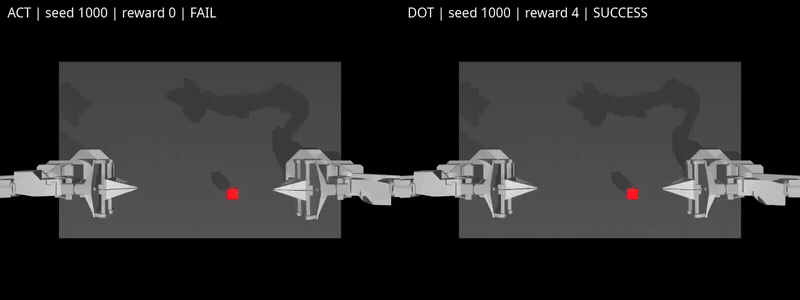

# Representative policy runs

These ALOHA clips show ACT and DOT attempting to transfer a cube between grippers from the same requested initial seed. Success means episode maximum reward >= 4.

[Watch the full-resolution video](media/aloha-comparison.mp4).

| Initial seed | ACT | DOT |
| --- | --- | --- |
| 1000 | Transfer not completed | Transfer completed |
| 1001 | Transfer completed | Transfer not completed |

These learned-policy rollouts were recorded on 2026-09-28. Shorter clips hold their last frame for synchronized playback. The two selected cases illustrate different behaviors and do not estimate overall success rates.

[Demo scores and provenance](../evidence/demo-results.json) identify these recordings. The [30-episode comparison](STUDY_RESULTS.md) uses separate seeds 2000–2029 and reports ACT 14/30 versus DOT 27/30. Native evaluator versions and preprocessing differ; results compare the concrete deployments.

Return to the [project overview](../README.md).
